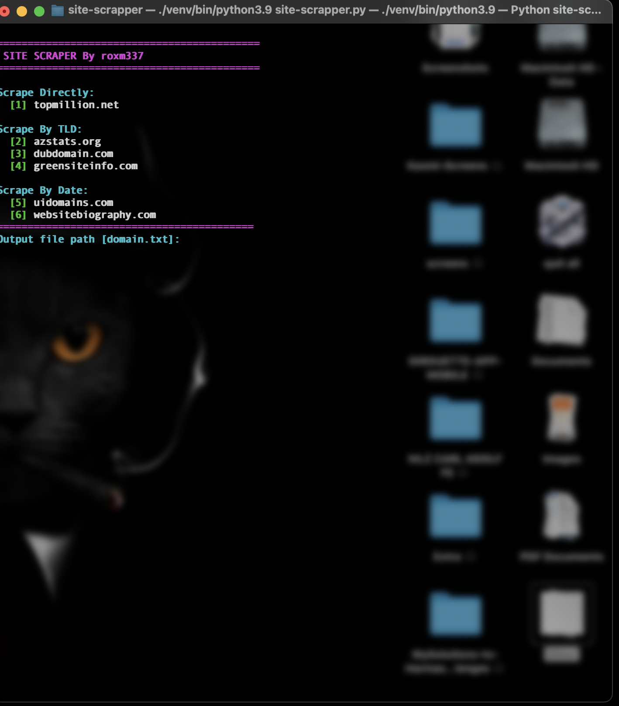
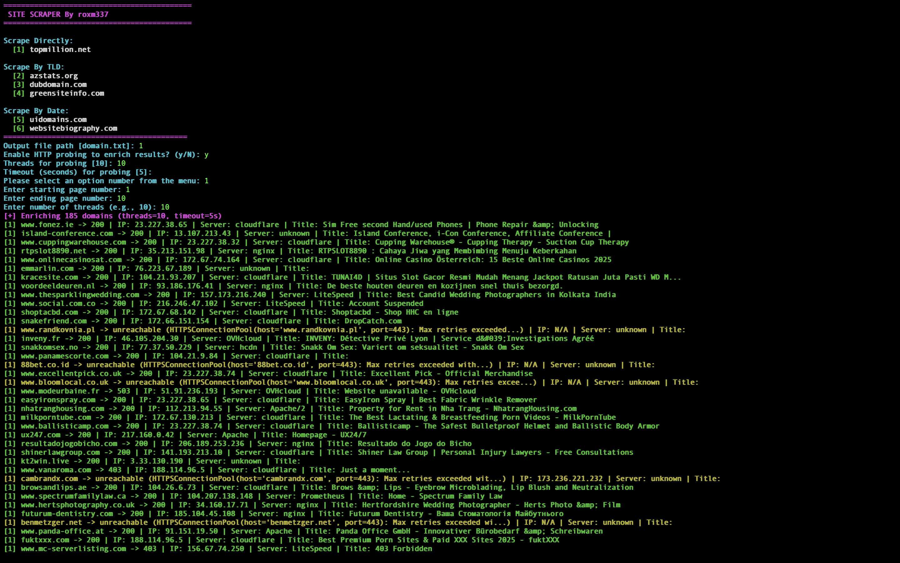

# Site Scrapper

Site Scrapper is an interactive recon utility for quickly harvesting fresh domains from several public catalogs and enriching them with HTTP fingerprinting data. The tooling is designed for pentesters and red teams who need a fast starting point for deeper recon.

## Features

- Interactive menu for multiple data sources (TopMillion, AZStats, DubDomain, GreenSiteInfo, UIDomains, WebsiteBiography).
- Domain normalization and deduplication before exporting.
- Optional HTTP enrichment that resolves IP addresses, probes for both HTTP/HTTPS, records status codes, server banners, and page titles.
- Threaded probing with configurable timeout to speed up reconnaissance.
- Tab-delimited output ready for ingestion into spreadsheets or further tooling.
- Colorized CLI experience for quick visual triage.

## Requirements

- Python 3.8+
- Dependencies listed in `requirements.txt`

Install dependencies with:

```bash
pip install -r requirements.txt
```

> **Note:** The enrichment mode disables TLS verification to ease probing during recon. Review before using on networks with strict policy requirements.

## Usage

1. Run the script:
   ```bash
   python site-scrapper.py
   ```
2. Choose an output path, whether to enable enrichment, thread count, and timeout when prompted.
3. Select a scraping option from the banner menu to fetch domain data.
4. Results are appended to the configured output file (defaults to `domain.txt`).

### Output formats

- **Standard mode:** One host per line.
- **Enrichment mode:** Tab-separated data with header including timestamp, source, host, base URL, final URL, HTTP status, IP, server, title, and error message (if any).

## Tips for Pentesters

1. Use enrichment with a dedicated output file to keep probe results separate from raw host lists.
2. Combine the TSV output with tools like `csvkit`, `jq`, or spreadsheet software for triage.
3. Feed successful hosts into follow-up tooling (e.g., Nmap, HTTP screenshotters, web tech fingerprinting) to accelerate recon workflows.
4. Consider pairing with subdomain enumeration tools and wordlists to build a more complete attack surface map.

## Screenshots

### Main Menu

*Interactive menu showing available data sources*

### Enrichment Mode Output

*Example of enriched domain data with HTTP details*

## Roadmap Ideas

- CLI argument support for non-interactive runs.
- Optional HTTP screenshot capture.
- Service banner parsing for frameworks and middleware hints.
- Integration with project-specific data stores for syncing results.

@roxm337

## Disclaimer

This project is intended for ethical security testing. Ensure you have authorization before probing any target domains.
# site-scout
